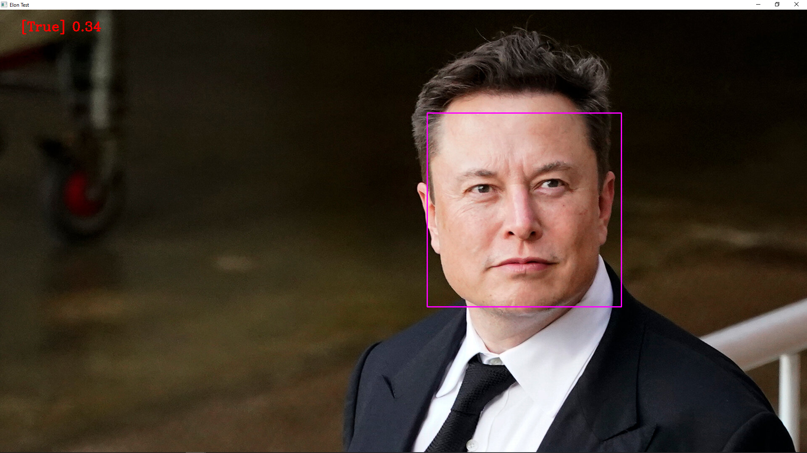

## Build Face Recognition Attendance System using Python

## General Overview
This git repository contain a Face Recognition Attendance System using Python.
Face recognition systems can be implemented by using facial characteristics as biometrics. Attendance tracking is the most difficult task in any organization. Face recognition is a biometric technique that determines whether the image of a person’s face matches any of the face images stored in a database.

The primary goal was of this project is to build a face recognition-based attendance monitoring system for employees working in an organization in order to improve and upgrade the current attendance system to make it more efficient and effective than before. The employee should be in an area containing light so that the detection can be clearly made.

The facial recognition feature embedded in the attendance monitoring system not only ensures accurate attendance but also eliminates flaws. Using a system to overcome defects not only saves resources but also reduces human intervention in the overall process by delegating all complex tasks to the system.

### Prerequisites
The installation process for this project is a bit more than usual. First I download a C++ compiler. I tried installing Visual Studios. I
downloaded the community version for free from their website (https://visualstudio.microsoft.com/downloads/). Once the installer I
run it and select the ‘Desktop development with C++’.
The download and installation took some time as it is a few Gbs.
After completing and restarting the computer, I head on to Pycharm project. Here, I install the required packages. Below is the list.
- cmake 
- dlib 
- face_recognition
- numpy opencv-python 
- Install pybuilder pip install pybuilder
- Build the project pyb publish

[Here](https://github.com/engineersakibcse47/FaceRecognition/blob/main/requirement.txt) is my requirement file.

## Project Documentation

###  Git
I used Git to frequently commit and push my code to GitHub. I also used GitHub action for continuous delivery. My git times can be seen at the [Github Contribution](https://github.com/engineersakibcse47) in GitHub. 

###  Unified Model Language

Unified Modeling Language (UML) is a standardized visual modeling language used for modeling and documenting the design of software systems. It provides a common vocabulary and set of symbols for representing various aspects of a software system, such as its structure, behavior, and interactions.

UML allows software developers to represent the design of a system in a visual, abstract manner, making it easier for them to communicate and understand the system's design. This can help to reduce errors and improve the quality of the system.

For the UML diagrams I chose to present the following:

- [Activity diagram](https://github.com/engineersakibcse47/FaceRecognition/blob/main/tasks/Activity_Diagram.jpg) this diagram provides a view of the behavior of a system by describing the sequence of actions in a process.
- [Use case diagram](https://github.com/engineersakibcse47/FaceRecognition/blob/main/tasks/UseCase_Diagram.jpg) describe the high-level functions and scope of a system. These diagrams also identify the interactions between the system and its actors. The use cases and actors in use-case diagrams describe what the system does and how the actors use it, but not how the system operates internally.
- [Sequence diagram](https://github.com/engineersakibcse47/FaceRecognition/blob/main/tasks/Sequence_Diagram.jpg) illustrates the sequence of messages between objects in an interaction. A sequence diagram consists of a group of objects that are represented by lifelines, and the messages that they exchange over time during the interaction.
- [Component diagram](https://github.com/engineersakibcse47/FaceRecognition/blob/main/tasks/Component_Diagram.jpg) to show the different components of the project. If I  get any investment [Future Work Component diagram](https://github.com/MaraAcuja/SudokuGame/blob/main/tasks/Component_Diagram_Future.jpg).

### Domain-Driven Design
Domain-Driven Design (DDD) is a software development approach that focuses on creating software that accurately reflects the underlying business domain and its complexities. It is a set of principles, practices, and patterns for modeling and designing software applications.
DDD is often used in complex, large-scale software projects where there is a need to accurately reflect the business domain and its complexities, and to ensure that the software supports the business needs effectively.

For the Domain Driven Design diagram, I had sketched what would be the complete [Problem Space](https://github.com/engineersakibcse47/FaceRecognition/blob/main/tasks/DDD_Diagram.jpg) for the application as starting point while 
drafting the general goal of the application. Some have been already implemented since then, some have to be implemented in the future, if I get fund from Edlich investments. The DDD diagram is also mapping the data flow 
relations as well as key partnerships for the application to work properly. Furthermore, I had created a small [glossary](https://github.com/engineersakibcse47/FaceRecognition/blob/main/tasks/glossary.pdf) containing ubiquitous language for each domain, this would allow a better understanding of the architecture and code.

### Metrics

For metrics, I chose Sonarqube online version because it's much easier to integrate with your repository that running a local server. SonarCloud assists in evaluating the health of code and developing applications with clean, secure code. Detect bugs and vulnerabilities and receive immediate feedback. 

It also gives you the ability to embed lots of different badges-

- 
- 
- 
- 
- 
- 
- 
- 
- 

### Clean Code Development

Here is my personal [Cheat sheet](https://github.com/engineersakibcse47/FaceRecognition/blob/main/tasks/CCD_cheat_sheet.pdf) with my most important code principles. As the whole project is written completely in Python I decided to write also the cheat sheet in Python. This is good for testing my clean code principles as for showing some special features

I tried to follow the 10 points the standards of clean code.

- Use descriptive and meaningful variable names: Using descriptive and meaningful variable and functions names helps to make the code more self-explanatory and easier to understand, when you look in to the encoding and markattendance function you can immediately understand what is it doing, that's the case also for all the variables as well.
- Use comments to explain the code: Adding comments to the code helps to explain the purpose and logic of the code, making it easier for others to understand. The code itself could be almost readable as English.
- Follow a consistent coding style: Using a consistent coding style throughout the codebase helps to improve the readability and maintainability of the code.
- Keep the code organized: Keeping the code organized by using indentation, white space, and blocks can make the code easier to read and understand.
- Use functions to break up large blocks of code: Breaking up large blocks of code into smaller, more focused functions can make the code more modular and easier to understand.
- Avoid using magic numbers: Magic numbers are hardcoded values that have no clear meaning. Instead, it is better to use constants or named variables to represent these values.
- DRY: DRY stands for don't repeat yourself. The principle is very important in my opinion, because repetition of code is easily avoidable and makes the code very hard to maintain. Two common rules to make sure to apply DRY is to define constants for values which occur frequently. Another is to use functions/classes/methods which increase the abstraction level of the code, so that it becomes reusable by design. 
- KISS: KISS means keep it simple stupid. Applying this principle makes sure that the code is simple to understand. In general, it states that simple solutions should be preferred to complicated. This obviously depends on the sitation a lot. I mostly apply this principle when choosing pybuilder build manegment over other solutions there are because its very simple and straightforward to maintain code.
- Test and debug the code: Testing and debugging the code can help to identify and fix any issues, ensuring that the code is reliable and working as intended.
- Use documentation: Adding documentation to the code helps to explain the purpose and usage of the code, making it easier for others to understand and use.

### Build Management
With the move to continuous integration and continuous delivery, build management has become an important part of the software development and testing lifecycle. Build management is the process of collecting all of the assets to be included in a software release, performing all the automated tasks to compile, build and test the system and then deploy onto the development and testing environments in preparation for staging.

For build management I had used pybuilder, which is a powerful tool when using python. PyBuilder is a software build automation tool written in pure Python mainly targeting Python ecosystem. It is based on the concept of dependency-based programming but also comes along with powerful plugin mechanism that allows the construction of build life-cycles similar to those known from other famous build tools like Apache Maven and Gradle. It is the first time that I configured a build management tool myself. You can find 3 files created for this purpose:

- Build file [build.py](https://github.com/engineersakibcse47/FaceRecognition/blob/main/build.py) 
- Setup file [setup.py](https://github.com/engineersakibcse47/FaceRecognition/blob/main/setup.py) 
- toml file [pyproject.toml](https://github.com/engineersakibcse47/FaceRecognition/blob/main/pyproject.tolm) 

After configured the files, if I run pyb from cmd the [build file](https://github.com/engineersakibcse47/FaceRecognition/blob/main/tasks/build.png)  showing the build ran successfully.

### Testing
In testing, I have written 2 testing file. First testing is basic test,  I tried to figure out system could recognize the faces correctly or not. For testing, I wrote this file [BasicTest](https://github.com/engineersakibcse47/fc3/blob/main/src/unittest/python/Basictest.py).
I used Elon Mask Images for testing purpose, I used a training image and a test image of Elon Musk.
Here, clearly showing system working properly and identify the Elon Musk [TRUE VALUE].  

 

Second testing is unittest, here is testing file [uni_tests.py](https://github.com/engineersakibcse47/FaceRecognition/blob/main/src/unittest/python/projectunittest.py) This unit test is testing the **markattendance** and **face_recognition** functions in the **AttendanceProject** module.

- The **setUp** method initializes the test data by adding a known test image and its corresponding class name to the photos and classNames lists. It also calculates the encodings for the known faces using the findencodings function.
- The **test_markattendance** method tests that the **markattendance** function adds an entry to the Attendance.csv file, and that the entry has the correct class name.
- The **test_face_recognition** method tests that the face recognition correctly identifies the known face in a test image. It does this by comparing the encodings of the test image with the encodings of the known faces, and checking that the minimum distance between the encodings is less than a certain threshold (0.60 in this case). It also checks that the class name of the recognized face is correct.
### Continuous Delivery 
Continuous Delivery (CD) is a software development practice in which code changes are automatically built, tested, and deployed to production. The goal of CD is to enable faster and more reliable software releases by eliminating manual and error-prone steps in the release process.

Continuous Integration (CI) is a software development practice in which code changes are frequently integrated into a single codebase, typically multiple times per day. The goal of CI is to detect and fix integration problems as soon as possible, by running automated tests and builds, to reduce the time and effort required to release new features and bug fixes to production.

For the continuous delivery pipeline I used GitHub Actions to create the continuous delivery [CD] pipeline. 
In combination with pybuilder it is very convenient to use. Every time I push to my repository a new build is
triggered.; my workflow CI pipeline builds including the following tasks:

- Set up job
- Run actions/checkout@v3
- Set up Python 3.9
- Lint with flake8
- PyBuilder Action
- Post PyBuilder Action
- Post Set up Python 3.9
- Post Run actions/checkout@v3
- Complete Job

Here is the continuous delivery pipeline yml file [python-package.yml](https://github.com/engineersakibcse47/FaceRecognition/blob/main/.github/workflows/python-package.yml) for CD Management. 

### IDE

I had used PyCharm 2022.2.4 (Community Edition) using Anaconda Python 3.9 as interpreter. I find very useful to use it this way for an easier environment and package management even if I decide to use other tools like Jupyter Notebook or Google collab, Anaconda as interpreter will save time not having to install save packages everywhere. The integration with Git using this IDE was straight forward and I was able to commit, pull and push updates without facing an issue, would be interesting to start trying it with multiple branches for more complex project.
Another feature I like very much about this IDE, is the new package manager for PyCharm that allows you to install and update packages within few click, no pip is needed. My most used shortcuts are:

- Ctrl + K to show commit window
- Ctrl + Shift + C to cpy document path
- Alt + Shift + F9 to run selected

Full short-cut list could be found [Here](https://resources.jetbrains.com/storage/products/pycharm/docs/PyCharm_ReferenceCard.pdf)

### DSL
DSLs are specialized programming languages that are created to solve specific problems in a particular domain. They offer a concise syntax, improved readability, and a focus on domain-specific concepts, making them easier to learn and use for developers who are familiar with the domain. DSLs can automate repetitive tasks, model complex systems, or provide an interface for users who are not familiar with general-purpose programming languages. By using DSLs, developers can write code that is easier to understand and maintain, and which can solve complex problems in a specific domain in a more efficient and straightforward manner.

For DSL in practical day-to-day life I created a small weekly work routine tracker where we can write our activities like-Exercise, Study, Home-work, Refreshment and so on in minutes and hours how much time we spent in different
activities, then my implemented functions will summarize the time per activity and show the results in hours. My weekly routine [.dsl file](https://github.com/engineersakibcse47/FaceRecognition/blob/main/tasks/daily_routine_tckr.dsl) along with the [python interpreter](https://github.com/engineersakibcse47/FaceRecognition/blob/main/tasks/dsl_interpreter.py), you just have to run the dsl file from console with given python interpreter.
- Following cmd: `python dsl_interpreter.py daily_routine_tckr.dsl`

### Functional Programming
Functional programming (FP) is a software development paradigm that prioritizes the use of pure functions to construct and maintain software systems. The focus of functional programming is on the use of declarations and expressions rather than the execution of statements. Functions are considered to be a first-class entity in functional programming, which means they can be passed as arguments, returned from other functions, and assigned to variables.

In functional programming, the emphasis is on immutability and avoiding side effects. This results in code that is easier to test and less prone to bugs. To achieve this, functional programming relies heavily on the use of higher-order functions and the concept of function composition.

Functional programming has become increasingly popular in recent years due to its ability to handle complex and concurrent systems with ease. It has been used in a variety of applications, including data processing, game development, and machine learning.

I tried to use functional style where possible. Below, there are some links to examples for the implementation of function:
1. [findEncodings()](https://github.com/engineersakibcse47/FaceRecognition/blob/main/src/main/python/AttendanceProject.py#L31) that takes a list of images and returns a list of their face encodings. It also defines the function called markattendance.
2. [markAttendance()](https://github.com/engineersakibcse47/FaceRecognition/blob/main/src/main/python/AttendanceProject.py#L46) takes a name as an argument and writes it and the current time to a file called 'Attendance.csv' if the name is not already present in the file. 

